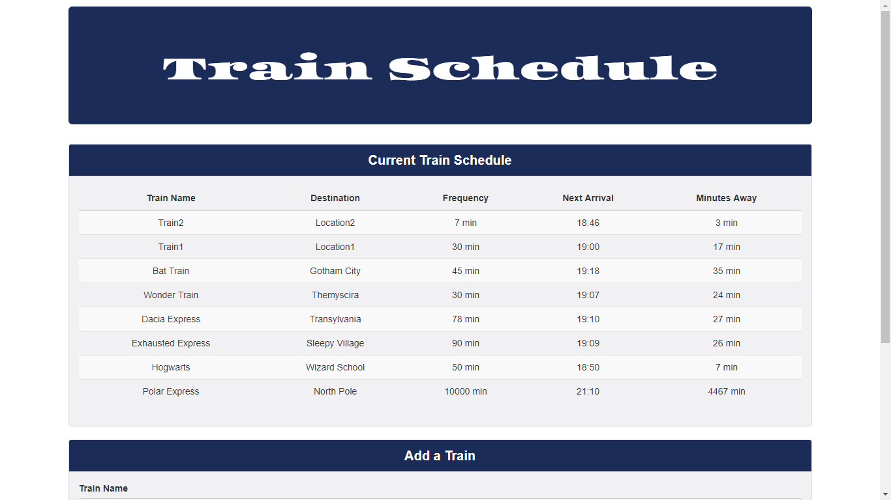

# TrainScheduler

A train schedule application that incorporates Firebase to host arrival and departure data. Your app will retrieve and manipulate this information with Moment.js. This website will provide up-to-date information about various trains, namely their arrival times and how many minutes remain until they arrive at their station.

Have some fun and try it out:
https://redpanda117.github.io/TrainScheduler/

